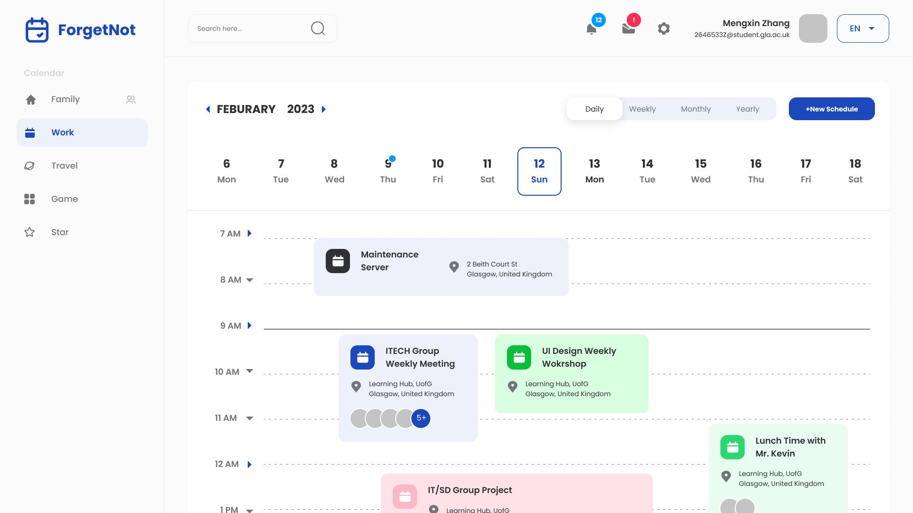
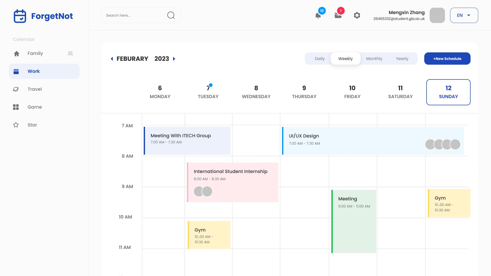
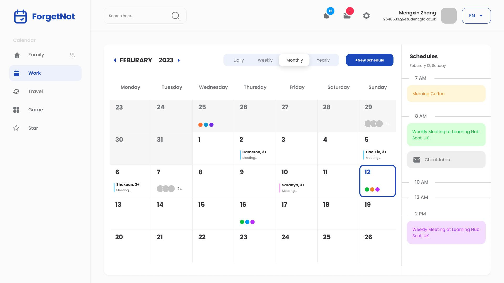
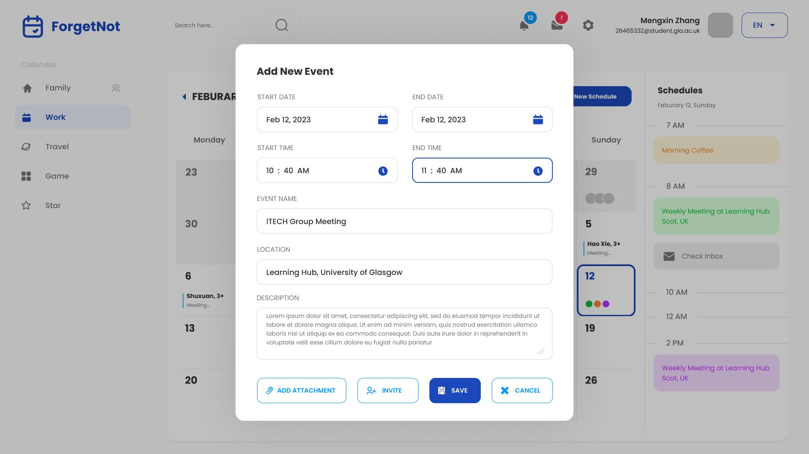
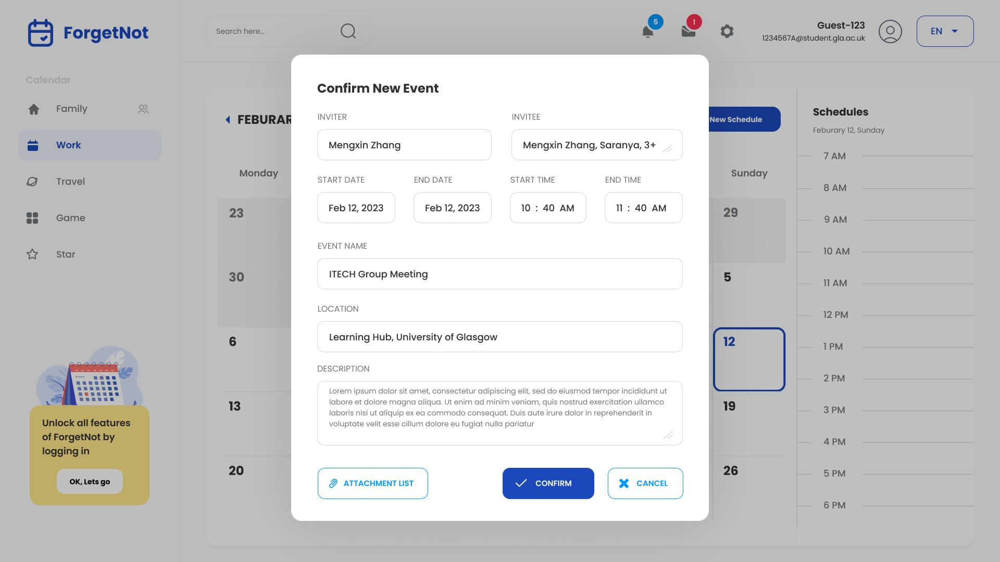

# ForgetNot: Event-Based Shareable Calendar

Welcome to **ForgetNot**, an intuitive and shareable calendar system based on events. Designed to ensure you never miss an important event, ForgetNot allows users to create, set reminders, and effortlessly share events with others.

## 🛠️ Tech Stack

- **Backend**: Powered by the robust [Django](https://www.djangoproject.com/) framework, ensuring scalability and security.

## ✨ Features

- **Event Creation**: Add new events to your calendar with just a few clicks.
- **Customizable Reminders**: Set reminders to ensure you're always on top of your schedule.
- **Seamless Sharing**: Let others see your events, and with their consent, add your events to their calendars.

## 📖 Documentation

For a deep dive into ForgetNot's functionalities and system architecture, please consult the [README.pdf](./README.pdf) located in the root directory.

## 🎥 Demonstrations

- **Demo Video**: Experience ForgetNot in action. Watch the [demo_video.MP4](./demo/demo_video.MP4) in the `demo` folder.
- **Demo Images**:
  - 
  - 
  - 
  - 
  - 

## 💼 Contributions

I contributed to some of the design aspects and handled a significant portion of the backend development. For details on other members' contributions and roles, please refer to the [README.pdf](./README.pdf) in the root directory.

Dive into the world of efficient planning with **ForgetNot**. Thank you for exploring our platform!
